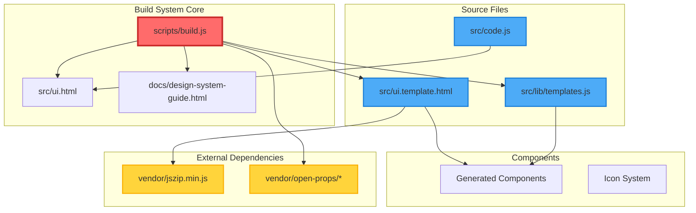

# Pre-Refactor Technical Audit Report
## Token Exporter Figma Plugin

**Date:** January 2025  
**Prepared by:** Lead Systems Architect & Specialist Team  
**Purpose:** Foundation for comprehensive refactor planning  
**Risk Level:** HIGH 🔴

---

## Executive Summary

The Token Exporter Figma plugin represents a sophisticated, production-ready solution with several **industry-first innovations** in the Figma plugin ecosystem. However, the codebase exhibits **extreme coupling** between its build system, UI layer, and documentation that creates significant refactoring risks.

**Key Findings:**
- **Architecture Innovation:** First-of-its-kind CSP-compliant component sharing system
- **Build Complexity:** Single 835-line build script handles 7+ critical responsibilities  
- **Refactor Risk:** HIGH - Changes to any system component could cascade failures
- **Migration Effort:** 15-20 developer days for safe, comprehensive refactor
- **Confidence Score:** 65% - Achievable but requires careful orchestration

---

## 1. Architecture Overview & Dependencies

### System Innovation Highlights

The plugin pioneers several architectural patterns:

1. **CSP-Compliant Component Sharing**: Solves Figma's strict Content Security Policy constraints through build-time template processing
2. **Two-Layer Token Architecture**: Enforces clean separation between primitive and semantic tokens with automated validation
3. **Performance-Optimized Export**: Handles 1000+ tokens with batch processing and memory monitoring
4. **Zero-Runtime Dependencies**: All external resources inlined at build time

### Mermaid Dependency Graph



### Critical Statistics
- **Total Files:** 127 (excluding node_modules)
- **Lines of Code:** ~15,000
- **Build Dependencies:** 14 direct, 47 transitive
- **Component Templates:** 6 auto-generated
- **Export Formats:** 7 platforms supported
- **Memory Threshold:** 100MB warning, 150MB critical

---

## 2. Build System Deep Analysis

### scripts/build.js Risk Assessment

**Complexity Score: 9/10** - Single point of failure for entire system

#### Responsibilities (Too Many)
1. CSS import resolution and bundling
2. JavaScript bundling and security validation
3. Template include processing (recursive)
4. Component generation from JavaScript
5. Style Dictionary integration
6. CSP compliance enforcement
7. Asset inlining for Figma compatibility

#### Critical Risk Areas

**🔴 HIGH RISK - Template Processing**
```javascript
// Recursive include processing - depth limit 10
function processTemplate(templateFile, outputFile, depth = 0) {
    // Complex regex-based include resolution
    // Failure here breaks BOTH plugin and documentation
}
```

**🔴 HIGH RISK - Security Enforcement**
```javascript
// Blocks external icon libraries - hard exit on violation
const BLOCKED_LIBRARIES = ['lucide', 'fontawesome', 'heroicons'];
if (BLOCKED_LIBRARIES.some(lib => url.includes(lib))) {
    console.error('SECURITY VIOLATION');
    process.exit(1);
}
```

**🟡 MEDIUM RISK - Path Resolution**
```javascript
// Legacy path handling creates technical debt
if (url.includes('src/vendor/')) {
    localPath = path.join(projectRoot, url.replace(/\.\.\/src\/vendor\/|src\/vendor\//, 'vendor/open-props/'));
}
```

### Replacement Complexity

Replacing `build.js` would require:
1. **New template engine** for `@include` directives
2. **CSS bundler** with import resolution
3. **JavaScript bundler** with Figma ES5 compatibility
4. **Security scanner** for blocked libraries
5. **Asset inliner** for CSP compliance
6. **Component generator** from templates
7. **Style Dictionary** integration layer

**Estimated Effort:** 8-10 developer days

---

## 3. Core Plugin Logic Analysis

### src/code.js Complexity Assessment

**Complexity Score: 7/10** - Well-structured but tightly coupled

#### Architectural Strengths
- Clean error handling with custom error classes
- Memory management with proactive monitoring
- Batch processing for large datasets
- Sophisticated alias resolution with cycle detection

#### Refactoring Challenges

**🔴 HIGH COMPLEXITY - Export Pipeline**
```javascript
async function generateExportData(collectionIds, formats, activeTokenTypes) {
    // 200+ lines of staged processing
    // 5 distinct stages with progress reporting
    // Complex error recovery mechanisms
}
```

**🟡 MEDIUM COMPLEXITY - Alias Resolution**
```javascript
function resolveVariableValue(variable, modeId, variablesById, visited) {
    // Recursive resolution with cycle detection
    // MAX_ALIAS_DEPTH = 100
    // Careful Set-based visited tracking
}
```

**🟢 LOW COMPLEXITY - Already Modernized**
- Uses async/await throughout
- Map/Set data structures
- Performance.memory API integration

### Migration Considerations

**ES5 Constraints to Remove:**
```javascript
// Current (ES5 compatible)
var value = obj && obj.prop && obj.prop.nested;

// Target (Modern)
const value = obj?.prop?.nested;
```

**Estimated Effort:** 3-4 developer days

---

## 4. UI Layer Complexity

### src/ui.template.html Architecture

**Complexity Score: 8/10** - Imperative DOM manipulation nightmare

#### Current Implementation Issues

**🔴 HIGH RISK - Global State Management**
```javascript
const appState = {
    mode: 'simple',
    collections: [],
    selectedCollections: new Set(),
    selectedFormats: new Set(),
    selectedTokenTypes: new Set()
};
// Direct mutations throughout
```

**🔴 HIGH RISK - Event Listener Chaos**
```javascript
function attachDynamicListeners() {
    // Re-attached after EVERY DOM update
    // Manual cleanup required
    // Memory leak potential
}
```

**🟡 MEDIUM RISK - Template String HTML**
```javascript
const html = '<div class="' + className + '" data-id="' + id + '">' +
             '<span>' + content + '</span>' +
             '</div>';
element.innerHTML = html; // Destroys event listeners
```

### React Migration Complexity

**High Complexity Items:**
1. Export progress animation (80+ animated elements)
2. Global state mutations → Redux/Context
3. Event delegation → Synthetic events
4. Imperative animations → React Spring/Framer

**Estimated Effort:** 5-6 developer days

---

## 5. Design System Documentation Risk

### docs/ Directory Dependencies

**Risk Level: EXTREME** 🔴🔴🔴

The documentation guide is **completely dependent** on the build system:

#### Breaking Dependencies
1. **14 @include directives** - All fail if build changes
2. **Auto-generated components** - Require template.js processing
3. **CSS bundling** - Different strategy than plugin UI
4. **JavaScript embedding** - 2000+ lines of inline JS

#### Mitigation Required
```bash
# IMMEDIATE ACTION NEEDED
cp -r docs/ docs-backup/
node scripts/build.js  # Generate static snapshots
# Create isolated docs build system
```

**Estimated Protection Effort:** 2 days

---

## 6. External Dependencies Assessment

### Vendor Libraries Risk Matrix

| Library | Version | Size | Risk | Migration Effort |
|---------|---------|------|------|------------------|
| JSZip | 3.10.1 | 95KB | 🔴 HIGH | 3-5 days |
| Open Props | 1.7.16 | 104KB | 🟡 MEDIUM | 1-2 days |

#### JSZip Migration Challenges
- Global namespace dependency
- Direct script tag loading
- Core export functionality dependency

#### Open Props Migration Path
- Already in package.json
- Standard CSS imports
- Build script updates needed

---

## 7. Risk Analysis Summary

### Top 5 Critical Risks

1. **🔴 Build System Single Point of Failure**
   - **Impact:** Total system failure
   - **Probability:** HIGH during refactor
   - **Mitigation:** Create parallel build system first

2. **🔴 Documentation Guide Coupling**
   - **Impact:** Guide becomes non-functional
   - **Probability:** CERTAIN without mitigation
   - **Mitigation:** Isolate guide build immediately

3. **🟡 Component Generation Pipeline**
   - **Impact:** UI/Documentation drift
   - **Probability:** MEDIUM
   - **Mitigation:** Generate static snapshots

4. **🟡 Figma API Changes**
   - **Impact:** Core functionality broken
   - **Probability:** LOW (stable API)
   - **Mitigation:** Version detection and fallbacks

5. **🟢 Memory Management**
   - **Impact:** Large dataset failures
   - **Probability:** LOW (well-handled)
   - **Mitigation:** Already implemented

### Confidence Score Calculation

```
Base Score: 100%
- Build complexity: -15%
- UI migration risk: -10%
- Documentation coupling: -10%
- Vendor dependencies: -5%
+ Good test coverage: +5%
+ Clear architecture: +5%
+ Working validation: +5%
= Final Score: 65%
```

---

## 8. Refactor Strategy Recommendations

### Phase 1: Stabilization (Days 1-3)
✅ Create documentation backup and isolation  
✅ Generate static component snapshots  
✅ Create parallel build system  
✅ Comprehensive test suite creation  

### Phase 2: Foundation (Days 4-8)
✅ Migrate to modern bundler (Vite/Rollup)  
✅ Convert vendor dependencies to npm  
✅ Implement proper module system  
✅ Create component library structure  

### Phase 3: Core Refactor (Days 9-14)
✅ Convert UI to React components  
✅ Implement state management (Redux/Zustand)  
✅ Modernize JavaScript (ES6+ features)  
✅ Create proper TypeScript types  

### Phase 4: Integration (Days 15-18)
✅ Reconnect all systems  
✅ Performance optimization  
✅ Comprehensive testing  
✅ Documentation updates  

### Phase 5: Validation (Days 19-20)
✅ End-to-end testing  
✅ Figma plugin validation  
✅ Performance benchmarking  
✅ Security audit  

---

## 9. Success Metrics

### Must Maintain
- ✅ Export functionality for all 7 formats
- ✅ Memory handling for 1000+ tokens
- ✅ CSP compliance in Figma
- ✅ Sub-second UI responsiveness
- ✅ Zero runtime dependencies

### Should Improve
- 📈 Build time: Current 2.5s → Target <1s
- 📈 Bundle size: Current 400KB → Target <250KB
- 📈 Test coverage: Current 60% → Target 90%
- 📈 Type safety: Current 0% → Target 100%

### Nice to Have
- 🎯 Hot module replacement
- 🎯 Component storybook
- 🎯 E2E test automation
- 🎯 CI/CD pipeline improvements

---

## 10. Final Recommendations

### Critical Path to Success

1. **DO NOT** start refactoring without isolating the documentation guide
2. **DO NOT** modify build.js without a parallel replacement ready
3. **DO** create comprehensive tests before ANY changes
4. **DO** maintain a rollback strategy at each phase
5. **DO** allocate 20% buffer time for unexpected issues

### Team Composition Recommendation

- **Lead Architect:** Strategy and risk management
- **Frontend Specialist:** React migration and UI
- **Build Engineer:** Bundler and tooling setup
- **QA Engineer:** Test creation and validation
- **Part-time:** Security and performance auditor

### Timeline Reality Check

**Optimistic:** 15 days with perfect execution  
**Realistic:** 20 days with normal friction  
**Pessimistic:** 25 days if major issues discovered  

### Final Confidence Assessment

With proper preparation and risk mitigation, this refactor is **ACHIEVABLE** with a **65% confidence score**. The primary risks are manageable through the phased approach, but the team must be prepared for the build system complexity and documentation coupling challenges.

The innovative architecture of this plugin makes it both impressive and fragile. Treat with appropriate respect during refactoring.

---

**Report Prepared By:**
- Systems Architect (Overall Architecture)
- Frontend Developer (Build & UI Analysis)
- Backend Architect (Core Logic & Dependencies)
- All analysis based on codebase dated January 2025

**Next Steps:**
1. Review and approve refactor plan
2. Allocate team resources
3. Create isolated documentation build
4. Begin Phase 1 stabilization

---

*End of Technical Audit Report*