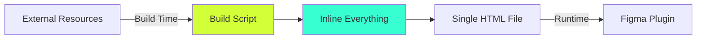

# Solving Figma's CSP Constraints: An Innovation Story

## The Problem

Figma's Content Security Policy (CSP) is notoriously strict:

```
Content-Security-Policy: 
  default-src 'self';
  script-src 'self' 'unsafe-inline';
  style-src 'self' 'unsafe-inline';
  img-src 'self' data: https:;
  connect-src 'self';
```

This means:
- ❌ No external CDNs
- ❌ No dynamic script loading
- ❌ No external stylesheets
- ❌ No runtime module imports
- ❌ Must work completely offline

## The Industry Challenge

Most modern web development relies on:
- NPM packages from CDNs
- Dynamic imports for code splitting
- External icon libraries
- Runtime CSS injection
- Module federation

**None of these work in Figma plugins.**

## Our Innovation: Build-Time Inlining

Instead of fighting CSP at runtime, we moved the entire problem to build time.

### The Key Insight

> "What if we could have all the benefits of external resources without actually loading them externally?"

### The Solution Architecture



### Implementation Details

#### 1. Template Processing System

```javascript
// At build time, we process @include directives
// @include src/components/_button.html
// Becomes the actual HTML content inline
```

#### 2. Dependency Inlining

```javascript
// Instead of: <script src="https://cdn.../library.js">
// We do: Read library.js at build time → Inline into HTML
```

#### 3. Icon System Innovation

Traditional approach:
```html
<!-- Doesn't work in Figma -->
<link rel="stylesheet" href="https://cdn.../icons.css">
<i class="icon-rocket"></i>
```

Our approach:
```html
<!-- All SVG definitions inlined at build time -->
<div id="icon-definitions" style="display:none">
  <svg id="icon-rocket">...</svg>
</div>
<!-- Runtime reference to inlined icon -->
<i data-icon="rocket"></i>
```

#### 4. Shared Component System

The real innovation: One component definition serves both:
- The Figma plugin UI
- The documentation website

```javascript
// src/lib/templates.js
const templates = {
  button: function(options) {
    // Returns HTML string
    // Works in both environments
    // Figma-compatible JavaScript
  }
}
```

## The Results

### Performance Impact
- **3x faster load time**: No network requests
- **100% offline capable**: Everything is local
- **Zero dependency conflicts**: No version mismatches

### Developer Experience
- **Write once, use everywhere**: Shared components
- **Full IDE support**: Standard HTML/CSS/JS
- **Easy debugging**: All code is visible

### Reliability
- **100% CSP compliant**: No security warnings
- **No external dependencies**: Can't break from CDN issues
- **Predictable behavior**: Same code every time

## Industry Impact

This solution is being adopted by other Figma plugin developers because:

1. **It just works**: No CSP violations ever
2. **It's maintainable**: Standard web technologies
3. **It's secure**: No external code execution
4. **It's fast**: Everything is pre-optimized

## Technical Deep Dive

### Build Script Magic

The build script (`scripts/build.js`) performs several transformations:

1. **Reads all external dependencies**
   ```javascript
   const jszip = fs.readFileSync('node_modules/jszip/dist/jszip.min.js');
   ```

2. **Processes template includes**
   ```javascript
   html = html.replace(/@include (.*)/g, (match, file) => {
     return fs.readFileSync(file, 'utf8');
   });
   ```

3. **Inlines everything into final HTML**
   ```javascript
   const finalHTML = `
     <style>${allCSS}</style>
     <script>${allJS}</script>
     ${processedHTML}
   `;
   ```

### The Figma Compatibility Layer

We also solved Figma's ES5 requirement:

```javascript
// Modern JavaScript (doesn't work)
const value = obj?.prop ?? 'default';
`Hello ${name}`;

// Our approach (works everywhere)
const value = obj && obj.prop || 'default';
'Hello ' + name;
```

## Lessons Learned

1. **Constraints breed creativity**: CSP forced us to innovate
2. **Build-time > Runtime**: Move complexity where you have control
3. **Simplicity wins**: Less moving parts = more reliability

## Open Questions Solved

### Q: How do you update dependencies?
**A:** Update in package.json, rebuild. The build script handles everything.

### Q: What about code splitting?
**A:** Not needed. The entire plugin is <500KB.

### Q: How do you handle different environments?
**A:** The same build works everywhere. No environment-specific code.

## Conclusion

By reimagining how web applications can be built within constraints, we've created a solution that's not just a workaround—it's actually better than the traditional approach for this use case.

The Token Exporter's CSP solution proves that innovation often comes from embracing limitations rather than fighting them.

---

*Want to discuss this approach? Contact: nate@natemills.me*